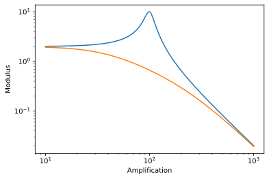
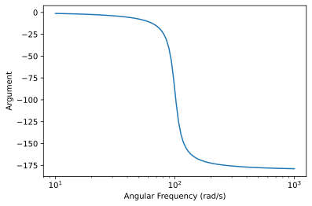

# Electronic Lib for second order system

   [](https://secondorderelec.readthedocs.io/en/latest/?badge=latest) 


A simple python library for the analysis of second order system.

## Getting Started

### Dependancies

* numpy
* matplotlib
* scipy

### Installing

Simple:
```bash
pip install SecondOrderElec
```

### Documentation

It's on [readthedocs](https://secondorderelec.readthedocs.io/en/latest/).

### Exemples

In this library you will find four main models for second order filters: 

- Low-Pass(```SecondOrderElec.LP```)
- High-Pass (```SecondOrderElec.HP```
- Band-Pass (```SecondOrderElec.BP```)
- Notch (```SecondOrderElec.Notch```)

```Python
from SecondOrderElec import LP
import numpy as np

w = np.logspace(1,3,1000)

filter_instance = LP(T0=1, m=1.1, w0=6000)
t,s = filter_instance.freqresp(w=w, plot=True)
```
 


You will find others exemples [here](https://github.com/slashformotion/SecondOrderElec/tree/master/exemples).

### Help

Create an issue [here](https://github.com/slashformotion/SecondOrderElec/issues).

### Acknowledgments

Most of the work is from [Vincent Choqueuse](https://github.com/vincentchoqueuse).

### Maintainers

- [@vincentchocqueuse](https://github.com/vincentchoqueuse)
- [@slashformotion](https://github.com/slashformotion)

### Licence

THE SOFTWARE IS PROVIDED "AS IS", WITHOUT WARRANTY OF ANY KIND, EXPRESS OR
IMPLIED, INCLUDING BUT NOT LIMITED TO THE WARRANTIES OF MERCHANTABILITY,
FITNESS FOR A PARTICULAR PURPOSE AND NONINFRINGEMENT. IN NO EVENT SHALL THE
AUTHORS OR COPYRIGHT HOLDERS BE LIABLE FOR ANY CLAIM, DAMAGES OR OTHER
LIABILITY, WHETHER IN AN ACTION OF CONTRACT, TORT OR OTHERWISE, ARISING FROM,
OUT OF OR IN CONNECTION WITH THE SOFTWARE OR THE USE OR OTHER DEALINGS IN THE
SOFTWARE.
